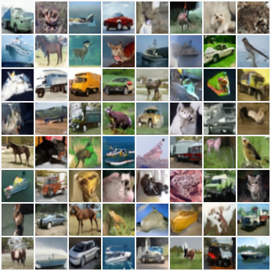

# fast-ddim-tf

A derivation-first TensorFlow DDIM implementation with reproducible CIFAR-10 FID sweeps across scheduler, prediction target, and loss weighting.

## Overview

This repository implements a fast DDIM-style diffusion pipeline in TensorFlow. It supports:

- training on image datasets from `.npz`, `.jpg`, `.png` files
- configurable network architecture and scheduler via YAML configs
- image generation with DDIM reverse sampling
- inline generation during training for monitoring
- CIFAR-10 utility script using `tf.keras.datasets`



Sample grid from the current best CIFAR-10 split: `net01`, `cosine`,
`noise`, `constant`, batch size = 128, global steps = 200k, FID `15.399408`.
<br> Training Time: 5.68hr with NVIDIA RTX 5090 Laptop GPU

## Math notes

The implementation follows the derivation in
[`docs/math_note/Diffusion_Model_Mathematics_Notes.pdf`](docs/math_note/Diffusion_Model_Mathematics_Notes.pdf).
The corresponding LaTeX source is available at
[`docs/math_note/Diffusion_Model_Mathematics_Notes.tex`](docs/math_note/Diffusion_Model_Mathematics_Notes.tex).
These notes describe the forward process, DDPM/DDIM reverse updates, and
prediction parameterizations used by `src/fddim/diffusion_utils.py`.
The derivation is written in continuous time and supports arbitrary reverse
time pairs `(s, t)` with `s < t`; the current sampler implementation uses a
uniform reverse timestep grid controlled by `REVERSE_STEPS`.

## Quickstart

1. Install dependencies:

```bash
python -m pip install -r requirements.txt
```

2. Generate a config template:

```bash
python scripts/run.py --get-template configs/default.yaml
```

3. Train with a config:

```bash
python scripts/run.py --config configs/cifar10_32x32.yaml --training
```

4. Generate images from a trained model:

```bash
python scripts/run.py --config configs/cifar10_32x32.yaml --imgen
```

## CIFAR-10 scheduler/prediction/loss-weight sweep

Run the 2x2x2 experiment matrix for:

- `SCHEDULER`: `linear`, `cosine`
- `PRED_TYPE`: `velocity`, `noise`
- `LOSS_WEIGHT_TYPE`: `constant`, `min_snr`

The automation script trains each split sequentially, generates 50,000 images
from the latest EMA epoch checkpoint, and computes FID against CIFAR-10 test
images. Training, image generation, and FID are run as separate subprocesses to
reduce split-to-split GPU memory carryover.

```bash
python scripts/run_cifar10_scheduler_pred_sweep.py
```

Use `--dry-run` to write the split configs and print the commands without
starting training:

```bash
python scripts/run_cifar10_scheduler_pred_sweep.py --dry-run
```

Example 2x2x2 CIFAR-10 run:

```bash
python ./scripts/run_cifar10_scheduler_pred_sweep.py \
  --base-config configs/cifar10_32x32_net01.yaml \
  --work-dir ./experiments/cifar10_scheduler_pred_losswt_sweep/net01_bs128_200k \
  --output-root ./training_outputs/cifar10_scheduler_pred_losswt_sweep/net01_bs128_200k \
  --train-batch-size 128 \
  --gen-batch-size 512
```

Results are written under the selected work directory, for example
`experiments/cifar10_scheduler_pred_losswt_sweep/net01_bs128_200k/results/`.

### CIFAR-10 test results

Test with two different network structures.

#### Network structures

| Field | net01 | net02 |
| --- | --- | --- |
| Image | 32 | 32 |
| Channels | 3 | 3 |
| Block size | 1 | 1 |
| Res blocks | 2 | 2 |
| Norm groups | 32 | 32 |
| Base width | 64 | 128 |
| Multipliers | `[1, 2, 4]` | `[1, 2, 2, 2]` |
| Attention | `[false, true, true]` | `[false, true, false, false]` |
| Mid attention | true | true |
| Heads | 1 | 1 |
| Embedding | positional | positional |
| Dropout | 0.1 | 0.1 |
| Kernel | 3 | 3 |
| Cross attention | false | false |
| Classes | uncond | uncond |
| Skip | per_block | per_block |
| Trainable weights | 16.1M | 35.7M |

#### FID comparison

The following results:
- use unconditional training
- batch size 32, 128
- 200,000 total global steps over 100 training epochs
- EMA epoch-100 checkpoints
- 100 DDIM reverse steps
- 50,000 generated images, and 10,000 CIFAR-10 test images for the real FID reference. 
- Lower FID is better.

| Scheduler | Prediction | Loss weight | net01 batch 128 (old) | net01 batch 32 |
| ---       | ---        | ---         | ---:  | ---: |
| cosine | noise | constant | 15.399408 | 19.006805 |
| cosine | noise | min_snr | 17.402848 | 17.636943 |
| cosine | velocity | constant | 17.812076 | 24.998476 |
| cosine | velocity | min_snr | 18.442803 | 17.980634 |
| linear | noise | constant | 19.337241 | 25.263250 |
| linear | noise | min_snr | 21.146388 | 23.677097 |
| linear | velocity | min_snr | 22.027908 | 25.298657 |
| linear | velocity | constant | 25.917514 | 33.871343 |

Best completed old `net01` batch-128 split: `cosine_noise_constant` with FID `15.399408`.
Best completed latest `net01` batch-32 split: `cosine_noise_min_snr` with FID `17.636943`.

## CIFAR-10 dataset helper

Use `utils/download_cifar10.py` to save CIFAR-10 images to `./datasets/cifar10`:

```bash
python utils/download_cifar10.py
```

## Package entrypoint

After install, the command line entrypoint is:

```bash
fast-ddim-tf
```

## Repository layout

- `src/fddim/`: core TensorFlow model and utilities
- `configs/`: YAML examples and templates
- `utils/`: dataset scripts and helpers
- `scripts/`: runnable entrypoints

## Notes

- The implementation uses TensorFlow/Keras.
- The main training and generation logic is in `src/fddim/cli.py`.
- `src/fddim/diffusion_utils.py` contains the diffusion schedule and DDIM reverse sampling math.
